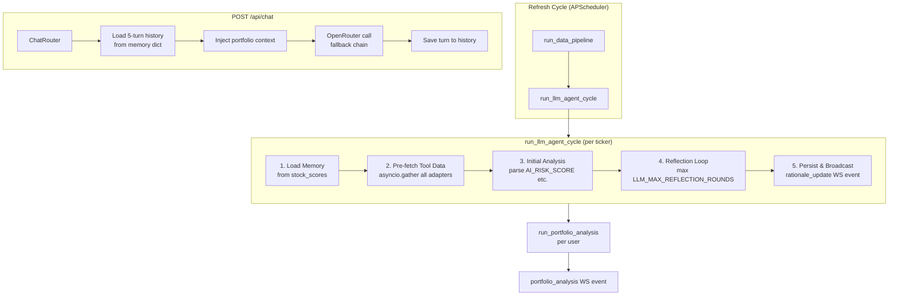

# Design Document: LLM Agent Loop

## Overview

The LLM Agent Loop feature upgrades `backend/llm_agent.py` from a single-shot prompt-response pattern into a proper agentic loop. The cycle runs as follows:

1. **Pre-fetch phase** — all enabled adapters are called concurrently via `asyncio.gather`; results are injected directly into the user message as structured JSON blocks. No function calling is used.
2. **Initial analysis** — the LLM produces a first-pass `AI_RISK_SCORE`, `AI_RECOMMENDATION`, and `RATIONALE`.
3. **Reflection phase** — the LLM critiques its own output up to `LLM_MAX_REFLECTION_ROUNDS` times, stopping early when the score delta is below `LLM_REFLECTION_DELTA`.
4. **Memory injection** — the previous cycle's score and rationale are prepended to the system prompt so the LLM can reason about what changed.
5. **Portfolio analysis** — after all per-ticker loops finish, a single cross-ticker pass identifies concentration risk and broadcasts a `portfolio_analysis` WebSocket event.
6. **Chat endpoint** — `POST /api/chat` exposes a conversational interface backed by the same model fallback chain, with per-user 5-turn history in server-side memory.

> **Implementation note**: The original design called for OpenRouter function calling (tool-call phase). The shipped implementation replaced this with `_prefetch_tool_data` — all adapters are fetched concurrently in Python and the results are injected into the prompt. The `_run_tool_call_phase` function is retained in the codebase but is no longer called from `_generate_rationale`. This change was made because free-tier models on OpenRouter have inconsistent function-calling support.

All LLM calls use direct `httpx` calls to `https://openrouter.ai/api/v1/chat/completions`. LangChain is **not** used for execution; the `ToolRegistry` is read only to extract adapter metadata and build the `adapter_map` used by `_prefetch_tool_data`.

---

## Architecture



### Key Design Decisions

- **Pre-fetch instead of function calling**: `_prefetch_tool_data(ticker, adapter_map)` calls all adapters concurrently with `asyncio.gather` and injects results as `[tool_name] {json}` blocks in the user message. This is more reliable than function calling across free-tier models.
- **Model fallback chain**: 8 models across diverse providers — `mistral-7b`, `llama-3.1-8b`, `gemma-3-4b`, `qwen3-8b`, `nemotron`, `stepfun`, `phi-4`, `deepseek-r1`. Models that return HTTP 429 are skipped after a 1-second sleep.
- **Output guardrails**: `_extract_structured_block` strips `<think>...</think>` reasoning blocks and fast-forwards to the first `AI_RISK_SCORE:` line. `_sanitize_rationale` detects ~12 leaked-prompt patterns and replaces bad output with a score-derived fallback sentence. Sanitizer runs twice: before and after the reflection loop.
- **Chat history in memory**: `dict[user_id, list[dict]]` stored as a module-level variable in `routers/chat.py`. Not persisted to DB; lost on restart. Capped at 5 turns (10 messages).
- **Portfolio analysis timeout**: wrapped in `asyncio.wait_for(..., timeout=60)` per user.
- **Auth**: all protected routes use `get_or_create_user(user, db)` to extract `user_id`. Civic Auth JWT uses `"id"` not `"sub"`.

---

## Components and Interfaces

### 1. `backend/settings.py` — Settings

```python
llm_reflection_delta: float = 3.0       # LLM_REFLECTION_DELTA
llm_max_reflection_rounds: int = 2      # LLM_MAX_REFLECTION_ROUNDS (capped at 3)
llm_max_tool_calls: int = 5             # LLM_MAX_TOOL_CALLS (retained, unused by main loop)
llm_model: str = "mistralai/mistral-7b-instruct:free"
```

A `@field_validator` on `llm_max_reflection_rounds` enforces the hard cap of 3.

### 2. `backend/llm_agent.py` — Agent Functions

#### `_prefetch_tool_data(ticker, adapter_map) -> dict[str, Any]`

Fetches all adapters concurrently. Returns `{tool_name: validated_result}`. Failures are logged at WARNING and excluded from the result (not propagated).

#### `_build_analysis_user_message(ticker, risk_score, tool_data=None) -> str`

Builds the user message. When `tool_data` is provided, injects each result as `[tool_name] {json}` (capped at 800 chars per tool). Falls back to quant-score-only message when no data is available.

#### `_build_system_prompt(ticker, memory) -> str`

Builds the system message. Instructs the model to output only the three structured lines. If `memory` is not `None` and the previous rationale passes the leaked-prompt check, prepends previous score/rec/rationale (truncated to 300 chars). Combined prompt capped at 16 000 chars.

#### `_extract_structured_block(raw) -> str`

Strips `<think>...</think>` blocks, then fast-forwards to the first `AI_RISK_SCORE:` line. Returns the original string if no structured lines are found.

#### `_sanitize_rationale(rationale, ticker, score, rec) -> str`

Returns a clean rationale. Replaces content that is empty, shorter than 15 chars, or matches any of 12 leaked-prompt regex patterns with a score-derived fallback sentence.

#### `_run_reflection_loop(messages, initial_score, initial_rec, initial_rationale) -> tuple[float, str, str]`

Runs up to `LLM_MAX_REFLECTION_ROUNDS` critique rounds. Stops early if `|new_score - prev_score| < LLM_REFLECTION_DELTA`. Returns `(score, recommendation, rationale)`.

#### `_call_openrouter_with_tools(messages, tool_schemas=None) -> dict`

Iterates the 8-model fallback chain. Skips on 429 (with 1s sleep) or HTTP errors. Returns the full response dict.

#### `_generate_rationale(ticker, risk_score, memory, tool_schemas, adapter_map) -> tuple[str, float|None, str|None]`

Main per-ticker entry point. Calls `_prefetch_tool_data`, builds messages, calls LLM for initial analysis, sanitizes, runs reflection loop, sanitizes again. Returns `(rationale, ai_score, ai_rec)`.

#### `run_portfolio_analysis(user_id, ticker_data) -> None`

Accepts `ticker_data: list[dict]` with `ticker`, `sector`, `ai_risk_score`, `ai_recommendation`. Computes concentration flags locally (no LLM needed for the math — sectors > 40% of portfolio). Calls LLM for a one-sentence summary. Broadcasts `portfolio_analysis` WS event.

### 3. `backend/routers/chat.py` — Chat Router

```
POST /api/chat
  Body:  {"message": str}
  Response: {"answer": str}
  Auth: require_auth (Civic Auth)
  Rate limit: 20/minute
```

Module-level `_chat_sessions: dict[str, list[dict]]` stores conversation history. Portfolio context (tickers, scores, recommendations, rationale) is loaded fresh from DB on each request.

### 4. WebSocket Events

`rationale_update` — broadcast per ticker after each agent loop completes:
```json
{
  "event": "rationale_update",
  "payload": {
    "ticker": "AAPL",
    "rationale": "...",
    "ai_risk_score": 42.0,
    "ai_recommendation": "HOLD",
    "rationale_at": "2026-03-21T10:00:00Z"
  }
}
```

`portfolio_analysis` — broadcast per user after all tickers complete:
```json
{
  "event": "portfolio_analysis",
  "payload": {
    "summary": "...",
    "concentration_flags": ["Technology"]
  }
}
```

---

## Data Models

```python
# backend/models.py
class ChatRequest(BaseModel):
    message: str

class ChatResponse(BaseModel):
    answer: str

class PortfolioAnalysisResult(BaseModel):
    summary: str = Field(..., max_length=500)
    concentration_flags: list[str] = Field(default_factory=list)
```

Memory structure (in-memory, `routers/chat.py`):
```python
_chat_sessions: dict[str, list[dict[str, str]]] = {}
_MAX_TURNS = 5  # 5 user + 5 assistant = 10 messages
```

---

## Error Handling

| Scenario | Behaviour |
|---|---|
| Adapter fetch fails in pre-fetch | Logged at WARNING, excluded from tool_data, loop continues |
| LLM returns 429 | 1s sleep, try next model in fallback chain |
| Initial parse fails (no AI_RISK_SCORE) | Falls back to quant score, rec=HOLD, empty rationale |
| Reflection parse fails | Retains previous round's values, stops reflection |
| Rationale matches leaked-prompt pattern | Replaced with score-derived fallback sentence |
| Empty portfolio on chat request | Returns static "no holdings" message without LLM call |
| Portfolio analysis < 2 tickers | Skipped entirely |
| Portfolio analysis timeout (60s) | Logged at WARNING, skipped for that user |
| All 8 models exhausted | `last_error` raised, caught by `_generate_rationale` try/except |

---

## Test Coverage

### What is tested (86 tests, all passing)

| Area | Test file | Coverage |
|---|---|---|
| Scoring engine — unit | `test_scoring.py` | Normalizers, `compute_recommendation`, `evaluate_criterion`, `compute_risk_score` — 14 classes, ~30 cases |
| Scoring engine — property | `test_scoring_property.py` | 4 properties × 100–200 examples: sensitivity, determinism, component ranges, threshold boundaries |
| LLM parser | `test_llm_parser.py` | 20 unit tests: structured format, fallback extraction, edge cases, clamping, case-insensitivity |
| Adapters — property | `test_adapters_property.py` | validate_output required-key rejection, truncation, ToolRegistry enabled/disabled filtering, error messages, fetch round-trips, news/SEC/earnings output shape |
| Models — property | `test_models_property.py` | StockData serialization round-trip (100 examples), malformed payload rejection (100 examples) |

### What is NOT tested

The following areas from the original design's testing strategy were not implemented:

- `_build_system_prompt` memory injection properties (P1–P3)
- `_run_tool_call_phase` message structure and call count cap (P5–P6) — function is retained but not called by main loop
- `_run_reflection_loop` — at-least-one-round, early stopping, max rounds cap (P7–P10)
- Chat history cap and portfolio context injection (P11–P12)
- Concentration flags threshold property (P13)
- Portfolio summary length cap (P14)
- WS broadcast event type (P15)
- `LLM_MAX_REFLECTION_ROUNDS` env cap (P16)
- INFO log fields (P17)
- `POST /api/chat` endpoint integration tests (auth, rate limit, empty portfolio)

These are all unit-testable without a live DB or LLM — they test pure functions and in-memory state. Adding them would bring the agent loop to the same coverage level as the scoring engine.
